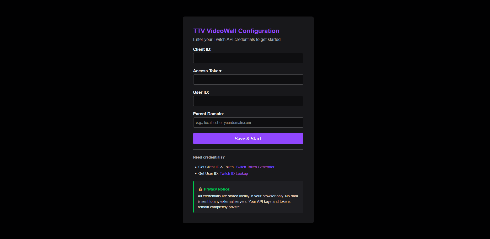

# Twitch Stream Tracker

A Simple web app that displays all your followed Twitch streams in a dynamic grid layout. The app automatically checks for stream status changes and refreshes when streamers go live or offline. Use Firefox! This does not work with Chrome!!!

## Features

- **Multi-stream grid view** - Watch multiple Twitch streams simultaneously
- **Auto-refresh** - Automatically detects when followed channels go live or offline
- **Responsive grid layout** - Dynamically adjusts grid based on number of active streams
- **Sorted by viewers** - Streams are ordered by viewer count (highest first)
- **Docker support** - Easy deployment with Docker/docker-compose
- **NOTE: <span style="color:red;"><u>FOR THE BEST RESULTS, USE A FIREFOX-BASED BROWSER!! CHROME-BASED BROWSERS DO NOT LIKE TO AUTOPLAY LARGE NUMBERS OF VIDEOS AT ONCE!!</u></span>**
## Screenshots

**Configuration Screen:**


**Fullscreen mode:**


## Prerequisites

- **Firefox Browser** - DO NOT USE CHROME!!!
- Twitch account with:
  - Client ID
  - OAuth Access Token
  - Your Twitch User ID
- Docker and Docker Compose (for development or local hosting.)

## Getting Your Twitch Credentials

1. **Get Client ID and OAuth Token:**
   - Visit [Twitch Token Generator](https://twitchtokengenerator.com/)
   - Click "Generate Token"
   - Select scopes: `user:read:follows`
   - Authorize with your Twitch account
   - Copy your **Client ID** and **Access Token**

2. **Get Your User ID:**
   - Visit [Twitch ID Lookup](https://www.streamweasels.com/tools/convert-twitch-username-to-user-id/)
   - Enter your Twitch username
   - Copy your **User ID**

## Installation and/or Usage

### Option 1: Use the website (The easy way!)

1. **In a FireFox-Based Browser:** https://vw.antx.dev

**<span style="color:red;"><u>BIG RED NOTE: No data input into the app is passed to the server. I do not receive your api keys. I can also not guarantee that the server will always be up.</u></span>**

### Option 2: Local Docker (Run your own!)

1. **Clone the repository:**
```bash
git clone https://github.com/antitux/videowall.git
cd videowall
```
2. **Run with docker-compose:**
```bash
docker-compose up -f docker-compose-example.yaml -d
```

3. **Access the app WITH FIREFOX:**
Open `http://localhost:8080` in your browser

### Option 2: Local Development

1. **Clone the repository:**
```bash
git clone https://github.com/yourusername/twitch-stream-tracker.git
cd twitch-stream-tracker
```

2. **Start up Docker Compose**
```bash
docker compose -f docker-compose-dev.yaml up -d
```

6. **Access the app WITH FIREFOX:**
Open `http://localhost:8080` in your browser

## Docker Compose Configuration

**docker-compose.yml:**
```yaml
version: '3.8'

services:
  videowall:
    image: antitux/videowall:latest
    pull_policy: always
    container_name: videowall
    restart: unless-stopped
    ports:
      - "8080:80"
```

## Project Structure

```
videowall/
├── app.js                          # Main Javascript
├── Dockerfile                      # Docker configuration
├── docker-compose-dev.yaml         # Docker Compose configuration (local dev)
├── docker-compose-example.yaml     # Docker Compose configuration (example prod)
├── index.html                      # main index file
├── styles.css                      # CSS Style Files

└── scripts/                        # Helper scripts for running Firefox on Ubuntu Desktop in kiosk mode.
│ └── README.md                     # Helper Scripts README.md
│ └── firefox_desktop_restart.sh    # Restarts Firefox remotely
│ └── firefox_reload.py             # Refreshes Firefox via Marionette api
│ └── firefox.desktop               # Automatically launches Firefox on boot
│ └── xhost.desktop                 # Enables remote X11 sessions
└── .gitea/                         # Static CSS and Javascript
  └── workflows/                    # Static CSS Files
    └── build.yaml               # Build Automation script
```

## How It Works

1. **Fetches followed channels** from the Twitch API using your credentials
2. **Checks live status** for all followed channels every 60 seconds
3. **Automatically refreshes** the page when streams go live or offline
4. **Arranges streams** in an optimized grid layout (1x1 up to 6x6+)
5. **Sorts by viewer count** to prioritize popular streams
6. **Embeds Twitch players** with automatic muting and 480p quality

## Grid layouts

The app automatically calculates the optimal grid based on stream count:

- 1 stream: 1x1
- 2 streams: 2x1
- 3 streams: 3x1
- 4 streams: 2x2
- 5-6 streams: 3x2
- 7-9 streams: 3x3
- 10-12 streams: 4x3
- 13-16 streams: 4x4
- 17-20 streams: 5x4
- 21-25 streams: 5x5
- 26-30 streams: 6x5
- 31-36 streams: 6x6
- 36+ streams: I hope this works.. Yolo?

## Troubleshooting

### Streams not autoplaying
- DO NOT USE CHROME.
- Chrome blocks autoplay.
- Are you using Chrome?
- Firefox is the recommended browser for the best experience with this application
- For a fullscreen kiosk experience, run Firefox in kiosk mode:
```bash
firefox --kiosk http://localhost:6/?hide_header=true
```
- On Linux with X11, you can also use:
```bash
firefox --kiosk --new-window http://localhost:5000/?hide_header=true
```

### Streams not loading

- Verify your `PARENT DOMAIN` matches the domain you're accessing the app from
- If you're running locally, and the url is `http://localhost:{port}/`, then your Parent Domain is Localhost
- For production, use your actual domain (e.g., `example.com`)

### Auto-refresh not working

- Check browser console for errors
- Verify your OAuth token hasn't expired

### "No streams live" when streams are active

- Confirm your `USER_ID` is correct
- Check that your OAuth token has the `user:read:follows` scope
- Verify you're actually following the streamers on Twitch

### Template not found errors

- Check Docker build logs for copy errors
- Verify file permissions

## Contributing

Contributions are welcome! Please feel free to submit a Pull Request.

1. Fork the repository
1. Create your feature branch (`git checkout -b feature/AmazingFeature`)
1. Commit your changes (`git commit -m 'Add some AmazingFeature'`)
1. Push to the branch (`git push origin feature/AmazingFeature`)
1. Open a Pull Request

## License

This project is licensed under the GNU Affero General Public License v3.0 - see the [LICENSE](LICENSE) file for details.

Copyright © 2026 Antitux Networks LLC

## Acknowledgments

- Uses [Twitch API](https://dev.twitch.tv/docs/api/)

## Support

If you encounter any issues or have questions:
- Open an issue on GitHub
- Check existing issues for solutions
- Review the Twitch API documentation
